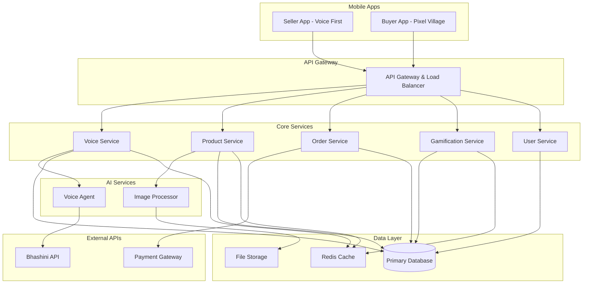

# Design Document: GaonSe

## Overview

GaonSe is a gamified pixel-village marketplace that bridges rural women entrepreneurs with urban consumers through an innovative dual-interface approach. The system combines a voice-first interface for rural sellers with an engaging pixel-art village experience for urban buyers, creating an inclusive platform that empowers rural entrepreneurship while providing authentic cultural experiences.

The architecture leverages AI-powered image processing, multilingual voice support via Bhashini API, and gamification mechanics centered around Digital Homesteads to create emotional connections between urban buyers and rural communities.

## Architecture

### High-Level System Architecture



### Technology Stack

**Frontend:**
- **Seller App**: React Native with voice-optimized UI components
- **Buyer App**: React Native with HTML5 Canvas for pixel-art rendering
- **Pixel Engine**: Custom Canvas-based rendering engine with sprite batching

**Backend:**
- **API Gateway**: Node.js with Express.js and rate limiting
- **Core Services**: Node.js microservices with TypeScript
- **Real-time Communication**: WebSocket connections for live updates

**AI & Processing:**
- **Image Processing**: Python-based service using OpenCV and PIL
- **Voice Processing**: Integration with Bhashini API for ASR/TTS
- **Background Removal**: AI models (U²-Net or similar) for automatic segmentation

**Data & Storage:**
- **Primary Database**: PostgreSQL for transactional data
- **File Storage**: AWS S3 or similar for images and audio
- **Caching**: Redis for session management and frequently accessed data

## Components and Interfaces

### Voice Service Interface

```typescript
interface VoiceService {
  // Speech-to-Text processing
  processVoiceCommand(audioData: Buffer, language: string): Promise<VoiceCommand>
  
  // Text-to-Speech generation
  generateVoiceResponse(text: string, language: string, voiceProfile: string): Promise<Buffer>
  
  // Language detection and switching
  detectLanguage(audioData: Buffer): Promise<string>
  switchLanguage(userId: string, newLanguage: string): Promise<void>
  
  // Offline capability
  cacheVoiceCommands(commands: VoiceCommand[]): Promise<void>
  syncCachedCommands(userId: string): Promise<void>
}

interface VoiceCommand {
  intent: 'ADD_PRODUCT' | 'CHECK_ORDERS' | 'UPDATE_INVENTORY' | 'GET_EARNINGS'
  parameters: Record<string, any>
  confidence: number
  language: string
  timestamp: Date
}
```

### Product Processing Service

```typescript
interface ProductProcessor {
  // Image enhancement pipeline
  processProductImage(imageData: Buffer, metadata: ImageMetadata): Promise<ProcessedProduct>
  
  // Background removal
  removeBackground(imageData: Buffer): Promise<Buffer>
  
  // Color correction and enhancement
  enhanceImage(imageData: Buffer): Promise<Buffer>
  
  // Pixel-art frame generation
  generatePixelFrame(frameType: FrameType, dimensions: Dimensions): Promise<Buffer>
  
  // Composite final product image
  compositeProductListing(productImage: Buffer, pixelFrame: Buffer): Promise<Buffer>
}

interface ProcessedProduct {
  enhancedImage: Buffer
  pixelFramedImage: Buffer
  extractedMetadata: ProductMetadata
  processingTime: number
  qualityScore: number
}

interface ProductMetadata {
  detectedFoodType: string
  estimatedIngredients: string[]
  colorProfile: ColorAnalysis
  suggestedPrice: number
  qualityIndicators: QualityMetrics
}
```

### Pixel Village Rendering Engine

```typescript
interface PixelVillageEngine {
  // Scene management
  initializeVillage(userId: string): Promise<VillageScene>
  updateHomestead(userId: string, items: HomesteadItem[]): Promise<void>
  
  // Rendering optimization
  renderVillageScene(viewport: Viewport, lodLevel: number): Promise<RenderFrame>
  batchSpriteDrawing(sprites: Sprite[]): Promise<void>
  
  // Performance management
  optimizeForDevice(deviceSpecs: DeviceCapabilities): RenderConfig
  manageMemoryUsage(): Promise<MemoryStats>
}

interface VillageScene {
  homesteads: Map<string, Homestead>
  marketplace: MarketplaceArea
  communitySpaces: CommunityArea[]
  backgroundLayers: Layer[]
}

interface Homestead {
  userId: string
  level: number
  items: HomesteadItem[]
  layout: GridLayout
  unlockProgress: UnlockProgress
}
```

### Gamification Service

```typescript
interface GamificationService {
  // Level progression
  calculateExperience(orderValue: number, sellerDiversity: number): number
  processLevelUp(userId: string, newLevel: number): Promise<LevelUpReward>
  
  // Item unlocking
  checkUnlockEligibility(userId: string, itemId: string): Promise<boolean>
  unlockHomesteadItem(userId: string, itemId: string): Promise<UnlockResult>
  
  // Achievement tracking
  trackAchievement(userId: string, achievementType: AchievementType): Promise<void>
  getPlayerProgress(userId: string): Promise<PlayerProgress>
}

interface HomesteadItem {
  id: string
  name: string
  type: 'FURNITURE' | 'DECORATION' | 'UTILITY' | 'PLANT'
  unlockLevel: number
  culturalSignificance: string
  pixelSprite: SpriteData
}

interface LevelUpReward {
  newLevel: number
  unlockedItems: HomesteadItem[]
  experienceGained: number
  specialRewards: SpecialReward[]
}
```

## Data Models

### User Models

```typescript
interface Seller {
  id: string
  name: string
  phoneNumber: string
  preferredLanguage: string
  voiceProfile: VoiceProfile
  location: GeoLocation
  businessMetrics: SellerMetrics
  verificationStatus: VerificationLevel
  createdAt: Date
}

interface Buyer {
  id: string
  username: string
  email: string
  homestead: Homestead
  gamificationProfile: GamificationProfile
  orderHistory: OrderSummary[]
  preferences: BuyerPreferences
  createdAt: Date
}

interface VoiceProfile {
  language: string
  dialect: string
  speechPattern: SpeechCharacteristics
  preferredVoiceSpeed: number
  customVocabulary: string[]
}
```

### Product Models

```typescript
interface Product {
  id: string
  sellerId: string
  name: string
  description: string
  category: FoodCategory
  originalImage: ImageAsset
  processedImages: ProcessedImageSet
  pricing: PricingInfo
  availability: AvailabilityStatus
  nutritionalInfo?: NutritionalData
  culturalContext: CulturalInfo
  createdAt: Date
  updatedAt: Date
}

interface ProcessedImageSet {
  enhancedOriginal: ImageAsset
  pixelFramedListing: ImageAsset
  thumbnails: ImageAsset[]
  frameType: PixelFrameType
  processingMetadata: ProcessingMetadata
}

interface ImageAsset {
  url: string
  width: number
  height: number
  format: string
  fileSize: number
  checksum: string
}
```

### Order Models

```typescript
interface Order {
  id: string
  buyerId: string
  sellerId: string
  items: OrderItem[]
  status: OrderStatus
  pricing: OrderPricing
  delivery: DeliveryInfo
  timeline: OrderTimeline
  gamificationImpact: GamificationImpact
  createdAt: Date
}

interface OrderItem {
  productId: string
  quantity: number
  unitPrice: number
  customizations?: ProductCustomization[]
  sellerNotes?: string
}

interface GamificationImpact {
  experienceAwarded: number
  itemsUnlocked: string[]
  achievementsEarned: string[]
  levelProgressContribution: number
}
```

## Correctness Properties

*A property is a characteristic or behavior that should hold true across all valid executions of a system—essentially, a formal statement about what the system should do. Properties serve as the bridge between human-readable specifications and machine-verifiable correctness guarantees.*

Now I need to analyze the acceptance criteria to determine which ones can be converted into testable properties.

### Voice Processing Properties

**Property 1: Multilingual Voice Command Processing**
*For any* voice command in a supported language (Hindi, English, Tamil, Telugu, Bengali, Marathi, Gujarati, Kannada), the Voice_Agent should correctly process the command using Bhashini API and execute the appropriate action
**Validates: Requirements 1.1, 4.2, 4.3**

**Property 2: Voice Response Language Consistency**  
*For any* text response to a seller, the Voice_Agent should convert it to speech in the seller's preferred language and deliver it successfully
**Validates: Requirements 1.3, 4.3**

**Property 3: Offline Voice Command Synchronization**
*For any* voice commands cached during offline periods, when connectivity is restored, all commands should sync successfully without data loss
**Validates: Requirements 1.5**

### Image Processing Properties

**Property 4: Product Image Processing Pipeline**
*For any* uploaded product photo, the Product_Processor should complete background removal, color correction, and pixel-frame composition within the specified time limit while maintaining image quality
**Validates: Requirements 3.1, 3.2, 3.3**

**Property 5: Image Quality Validation**
*For any* uploaded image that fails quality thresholds, the Product_Processor should reject it and request a new photo through voice guidance
**Validates: Requirements 3.4**

### Order Management Properties

**Property 6: Order Lifecycle State Transitions**
*For any* order, state transitions (placed → confirmed → ready → delivered) should update all parties via appropriate notification channels and maintain data consistency
**Validates: Requirements 5.1, 5.2, 5.3**

**Property 7: Order History Persistence**
*For any* completed order, it should appear in both buyer and seller order history with complete transaction details
**Validates: Requirements 5.4**

### Payment Processing Properties

**Property 8: Secure Payment Processing**
*For any* completed payment, the transaction should process through secure gateways, update seller earnings, and trigger payout within 24 hours
**Validates: Requirements 8.1, 8.2, 8.5**

**Property 9: Transaction Dispute Resolution**
*For any* transaction dispute, the system should provide a resolution workflow with voice support for sellers
**Validates: Requirements 8.4**

### Gamification Properties

**Property 10: Digital Homestead Progression**
*For any* buyer order, experience points should be awarded correctly, level progression should unlock appropriate homestead items, and items should be placeable in the buyer's plot
**Validates: Requirements 7.2, 7.3, 7.4, 7.5**

### Performance and Accessibility Properties

**Property 11: Mobile Device Resource Management**
*For any* mobile device meeting minimum specifications, the system should function within storage limits, optimize for poor connectivity, and manage battery usage appropriately
**Validates: Requirements 6.2, 6.3, 6.4, 6.5**

### Content Moderation Properties

**Property 12: Automated Quality Assurance**
*For any* product listing, the system should flag food safety issues, detect inappropriate content, and provide improvement feedback through voice guidance
**Validates: Requirements 9.1, 9.2, 9.4**

**Property 13: Community Rating System**
*For any* product or seller interaction, buyers should be able to rate quality and service, and ratings should be accurately tracked and displayed
**Validates: Requirements 9.3**

### Business Intelligence Properties

**Property 14: Seller Analytics and Insights**
*For any* seller requesting business insights, the Voice_Agent should provide comprehensive sales data, trends, and actionable recommendations in their preferred language
**Validates: Requirements 10.1, 10.2, 10.5**

**Property 15: Market Trend Notifications**
*For any* significant market trend change, relevant sellers should receive voice notifications about emerging opportunities
**Validates: Requirements 10.3**

## Error Handling

### Voice Processing Errors

**Language Detection Failures:**
- Fallback to Hindi as default language
- Provide manual language selection option
- Log detection failures for model improvement

**Bhashini API Failures:**
- Implement retry logic with exponential backoff
- Cache common responses for offline scenarios
- Provide text-based fallback for critical operations

**Voice Quality Issues:**
- Request clearer audio input through voice prompts
- Implement noise reduction preprocessing
- Provide alternative input methods when voice fails

### Image Processing Errors

**Upload Failures:**
- Retry mechanism for network issues
- Compress images automatically for large files
- Provide clear error messages through voice guidance

**Processing Timeouts:**
- Queue system for high-load periods
- Progressive processing with status updates
- Fallback to basic enhancement if AI processing fails

**Quality Validation Failures:**
- Specific feedback on image quality issues
- Guidance for better photo capture
- Multiple attempt allowance with coaching

### System Integration Errors

**Payment Gateway Failures:**
- Multiple payment provider fallbacks
- Transaction state recovery mechanisms
- Clear communication of payment status

**Database Connection Issues:**
- Connection pooling and retry logic
- Graceful degradation to cached data
- Offline mode activation for critical functions

**Third-Party Service Outages:**
- Circuit breaker patterns for external APIs
- Local processing fallbacks where possible
- User notification of service limitations

## Testing Strategy

### Dual Testing Approach

The testing strategy employs both unit testing and property-based testing to ensure comprehensive coverage:

**Unit Tests:**
- Focus on specific examples, edge cases, and error conditions
- Test integration points between components
- Validate specific user scenarios and workflows
- Cover error handling and boundary conditions

**Property-Based Tests:**
- Verify universal properties across all inputs through randomization
- Test system behavior with generated data sets
- Validate correctness properties defined in this design
- Ensure robustness across diverse input combinations

### Property-Based Testing Configuration

**Framework Selection:**
- **JavaScript/TypeScript**: fast-check library for property-based testing
- **Python Services**: Hypothesis library for AI/ML components
- **Integration Tests**: Custom property generators for end-to-end scenarios

**Test Configuration:**
- Minimum 100 iterations per property test
- Each property test references its design document property
- Tag format: **Feature: gaonse, Property {number}: {property_text}**
- Randomized test data generation for realistic scenarios

**Property Test Categories:**

1. **Voice Processing Tests:**
   - Generate random audio inputs in supported languages
   - Test voice command parsing and response generation
   - Validate offline synchronization behavior

2. **Image Processing Tests:**
   - Generate diverse food images with varying quality
   - Test processing pipeline performance and output quality
   - Validate background removal and enhancement accuracy

3. **Gamification Tests:**
   - Generate random user progression scenarios
   - Test experience calculation and item unlocking
   - Validate homestead customization functionality

4. **Order Management Tests:**
   - Generate complex order scenarios with multiple participants
   - Test state transitions and notification delivery
   - Validate payment processing and dispute resolution

### Integration Testing Strategy

**End-to-End Scenarios:**
- Complete seller onboarding and product listing flow
- Full buyer journey from discovery to purchase completion
- Cross-language communication between sellers and buyers
- Offline-to-online synchronization scenarios

**Performance Testing:**
- Mobile device performance under various conditions
- Pixel village rendering performance at 60fps
- Voice processing latency under network constraints
- Image processing throughput during peak usage

**Accessibility Testing:**
- Voice interface usability for users with varying tech literacy
- Multi-language support accuracy and cultural appropriateness
- Mobile accessibility for users with disabilities
- Low-bandwidth scenario testing for rural connectivity

### Monitoring and Observability

**Real-Time Metrics:**
- Voice processing accuracy and latency
- Image processing success rates and timing
- User engagement and progression metrics
- System performance and error rates

**Business Intelligence:**
- Seller success metrics and earnings tracking
- Buyer engagement and retention analysis
- Cultural impact measurement and community growth
- Platform adoption across different regions and languages